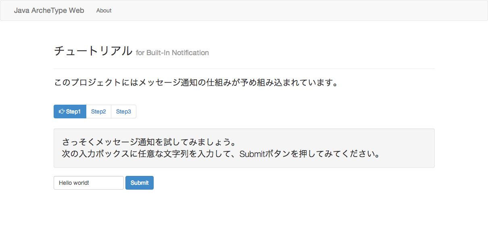

Sorry, This project is only the translation of Japanese ;-(

## Spring4 Samples

[Spring4.0][spring4]を学ぶために作成したWEBアプリケーションの雛形用プロジェクトです。  
(ブランチベースで学んだサンプルを随時追加予定)

こちらは[Maven Archetype][original-archetype]としても公開してます。  
SpringMVC4＋FreeMarkerベースのWEBプロジェクトが今すぐ作成できます。

フロント面は[Bootstrap3][bt3]＋[jQuery][jq]が予め組み込まれてます。



### 実行環境

* [JDK7][jdk7]
* [Maven3][maven]


### ビルドとWebアプリ起動

```shell
mvn clean package
mvn tomcat7:run
# ..
# Running war on http://localhost:8080/java-archetype-web
# ..
# Starting ProtocolHandler ["http-bio-8080"]
```

[jdk7]: http://www.oracle.com/technetwork/java/javase/downloads/jdk7-downloads-1880260.html
[maven]: http://maven.apache.org/download.cgi
[spring4]: http://projects.spring.io/spring-framework/
[bt3]: http://getbootstrap.com/ 
[jq]: http://jquery.com/
[original-archetype]: http://github.com/ogaclejapan/maven-archetypes

